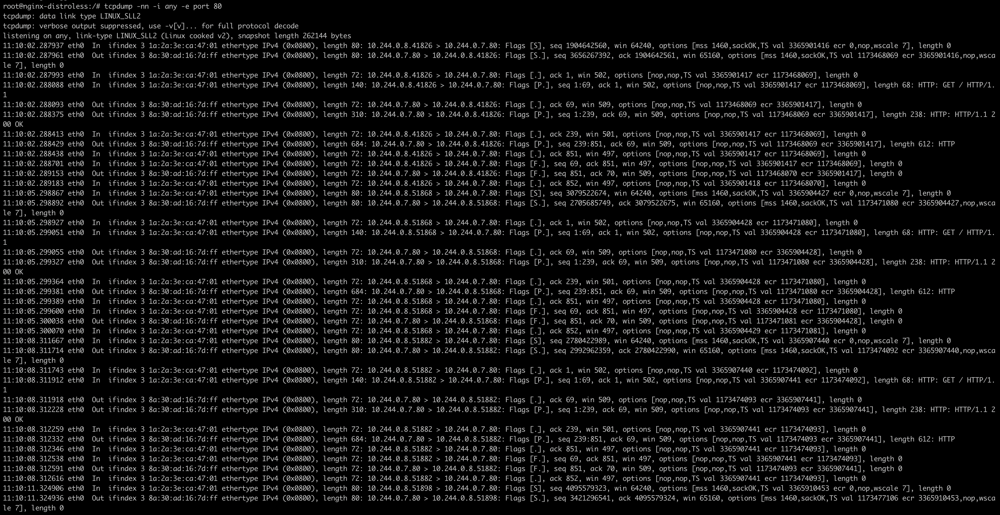
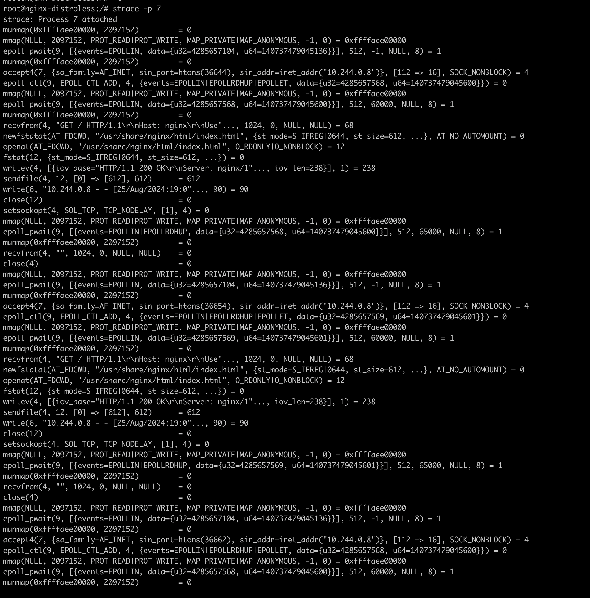
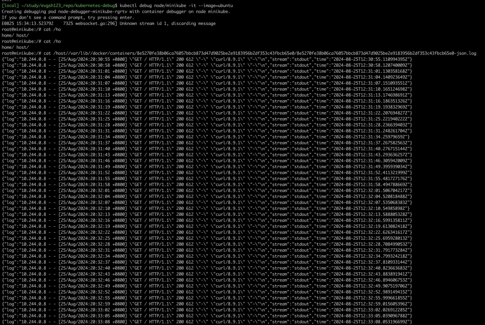

## Как запустить проект
```
kubectl apply -f nginx.yaml curl.yaml
```
В результате получим два пода
nginx и curl для генерации нагрузки
Подключимся дебагом
```
kubectl debug -it nginx-distroless --image=ubuntu --target=nginx-distroless --profile=sysadmin
```
В дебаг контейнере поставим все необходимые пакеты 
```
apt update
apt install -y tcpdump strace
```
Результат tcpdump


Результат strace


Выходим из контейнера и запустим дебаг контейнер к ноде:
```
kubectl debug node/minikube -it --image=ubuntu
```
Посмотреть логи контейнера с nginx
```
cat /host//var/lib//docker/containers/85270fe38b06ca76057bbcb873d47d9025be2e9183956b2df353c43fbcb65e0/85270fe38b06ca76057bbcb873d47d9025be2e9183956b2df353c43fbcb65e0-json.log
```

