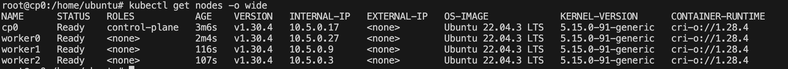
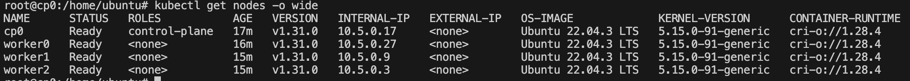

## Как запустить проект?
Создать файл .source где описать необходимые переменные
```
YC_TOKEN=
YC_FOLDER_ID=
YC_CLOUD_ID=
```
Запустить скрипт для развертывания кластера версии 1.30.4
```
./apply.sh
```
Вывод команды kubectl get nodes -o wide после запуска  скрипта apply


Запустить скрипт для апгрейда кластера на версию 1.31.0
```
 ./upgrade.sh
```
Вывод команды kubectl get nodes -o wide после запуска  скрипта upgrade


Запустить скрипт ./destroy.sh для удаления кластера
